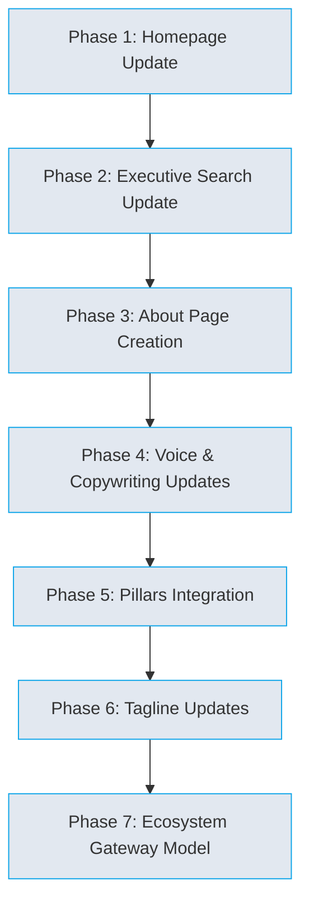

# IRBIS — Implementation Plan: Branding Strategy + Refonte Integration

> **Version**: 1.0
> **Date**: 2024-12-23
> **Status**: Ready for Implementation

---

## 📋 Overview

This plan integrates the new branding strategy from [`branding_strategy.md`](branding_strategy.md) with the existing refonte plan from [`refonte-plan.md`](refonte-plan.md). The new branding emphasizes:

- **Co-Ambition**: Irbis shares ambition with clients and helps pull organizations upward
- **Elevation**: Irbis strengthens judgment, standards, and leadership alignment
- **Sparring Partner**: Irbis challenges, refines, and executes leadership appointments with method, heart, and humility
- **In the Arena**: Irbis enters the arena with entrepreneurs and decision-makers as sparring partners

---

## 🎯 Implementation Tasks

### Phase 1: Homepage Update (Co-Ambition + Elevation)

**Objective**: Update homepage with new positioning options and co-ambition messaging

| # | Task | Description | Priority |
|---|---------|-------------|----------|
| 1 | Update homepage hero with Option A (balanced, premium) | High |
| 2 | Update homepage hero with Option B (sparring partner explicit) | High |
| 3 | Update homepage hero with Option C (elevation) | High |
| 4 | Update "What we do" section with new copy | High |
| 5 | Update "How we work" section with "arena" language | High |
| 6 | Update "Why Irbis" section with co-ambition pillars | High |
| 7 | Update ecosystem section with gateway model | High |
| 8 | Update final CTA band with new copy | High |

**Files to modify**:
- [`src/app/(marketing)/page.tsx`](src/app/(marketing)/page.tsx) - Homepage

---

### Phase 2: Executive Search Page Update (Sparring Partner)

**Objective**: Add "The sparring partner" section to Executive Search page

| # | Task | Description | Priority |
|---|---------|-------------|----------|
| 1 | Add "More than a search — a sparring partnership" section | High |
| 2 | Add "A partner who raises the bar — and stays accountable until the appointment lands" line under "What you can expect" | High |

**Files to modify**:
- [`src/app/(marketing)/executive-search/page.tsx`](src/app/(marketing)/executive-search/page.tsx)

---

### Phase 3: About Page Creation (Founder Energy + AI-Augmented)

**Objective**: Create new About page with founder energy, AI-augmented, method + connection

| # | Task | Description | Priority |
|---|---------|-------------|----------|
| 1 | Create `/about` route with hero section | High |
| 2 | Add "Method-obsessed. Human-led" headline and body | High |
| 3 | Add values section: Discipline • Presence • Illumination • Elevation | High |
| 4 | Add AI Agent Master Instructions section | High |

**Files to create**:
- [`src/app/(marketing)/about/page.tsx`](src/app/(marketing)/about/page.tsx)

---

### Phase 4: Voice & Copywriting Updates

**Objective**: Update all pages with new voice traits and sentence patterns

| # | Task | Description | Priority |
|---|---------|-------------|----------|
| 1 | Update homepage with Engaged, Demanding, Benevolent voice | High |
| 2 | Update Executive Search page with new voice | High |
| 3 | Update Approach page with new voice | High |
| 4 | Update References page with new voice | High |
| 5 | Update Contact page with new voice | High |
| 6 | Update Taylor Shift page with new voice | High |
| 7 | Update Paris page with new voice | High |
| 8 | Update Hunting pages with new voice | High |
| 9 | Replace "discreet" with "confidential by default" | High |

**Voice traits to apply**:
- **Engaged**: We're in it with you
- **Demanding**: High bar, precise language
- **Benevolent**: Respectful, never cynical

**Sentence patterns to use**:
- "We challenge the brief."
- "We make trade-offs explicit."
- "We carry ambition with you."
- "We raise the standard, then we execute."

---

### Phase 5: Pillars Integration

**Objective**: Update all pages with new pillars: Discipline, Presence, Illumination, Elevation

| # | Task | Description | Priority |
|---|---------|-------------|----------|
| 1 | Update homepage with new pillars | High |
| 2 | Update Executive Search page with new pillars | High |
| 3 | Update Approach page with new pillars | High |
| 4 | Update References page with new pillars | High |
| 5 | Update Contact page with new pillars | High |
| 6 | Update About page with new pillars | High |
| 7 | Update Taylor Shift page with new pillars | High |
| 8 | Update Paris page with new pillars | High |
| 9 | Update Hunting pages with new pillars | High |

**New pillars**:
- **Discipline**: A structured process that respects complexity without becoming rigid
- **Presence**: We listen, we read nuance, we hold human reality of decisions
- **Illumination**: We surface signal and explain trade-offs — so decisions are defensible
- **Elevation**: We share your ambition — and help pull the organisation upward

---

### Phase 6: Tagline Updates

**Objective**: Replace old taglines with new positioning options

| # | Task | Description | Priority |
|---|---------|-------------|----------|
| 1 | Update homepage with "High standards. Shared ambition." | High |
| 2 | Update homepage with "Rigor for human complexity." | High |
| 3 | Update homepage with "Method, with heart." | High |
| 4 | Update homepage with "In the arena, with you." | High |
| 5 | Update homepage with "Clarity for leaders who build." | High |

**Tagline options**:
- "High standards. Shared ambition."
- "Rigor for human complexity."
- "Method, with heart."
- "In the arena, with you."
- "Clarity for leaders who build."

---

### Phase 7: Ecosystem Gateway Model

**Objective**: Update ecosystem section with gateway model

| # | Task | Description | Priority |
|---|---------|-------------|----------|
| 1 | Update homepage ecosystem section with gateway model | High |
| 2 | Update Executive Search ecosystem section | High |
| 3 | Update About page ecosystem section | High |

**Gateway model structure**:
- Executive Search → Taylor Shift → Paris → Coming next
- Each service has dedicated site with external link
- CTA: "Discuss your context" for new services

---

## 📁 Files Summary

### New Files to Create
- [`src/app/(marketing)/about/page.tsx`](src/app/(marketing)/about/page.tsx) - About page

### Files to Modify
- [`src/app/(marketing)/page.tsx`](src/app/(marketing)/page.tsx) - Homepage
- [`src/app/(marketing)/executive-search/page.tsx`](src/app/(marketing)/executive-search/page.tsx) - Executive Search
- [`src/app/(marketing)/approach/page.tsx`](src/app/(marketing)/approach/page.tsx) - Approach
- [`src/app/(marketing)/references/page.tsx`](src/app/(marketing)/references/page.tsx) - References
- [`src/app/(marketing)/contact/page.tsx`](src/app/(marketing)/contact/page.tsx) - Contact
- [`src/app/(taylor-shift)/taylor-shift/page.tsx`](src/app/(taylor-shift)/taylor-shift/page.tsx) - Taylor Shift
- [`src/app/(paris)/paris/page.tsx`](src/app/(paris)/paris/page.tsx) - Paris
- [`src/app/hunting/mandates/page.tsx`](src/app/hunting/mandates/page.tsx) - Mandates
- [`src/app/hunting/talents/page.tsx`](src/app/hunting/talents/page.tsx) - Talents
- [`src/app/login/page.tsx`](src/app/login/page.tsx) - Login

---

## 🔄 Implementation Order

---

## 📝 Notes

- All changes should maintain the existing design system and component structure
- Use shadcn/ui components for consistency
- Maintain IRBIS terminology: talent, mandate, alignment
- Ensure accessibility with ARIA attributes and keyboard navigation
- Test all changes before deployment

---

## ✅ Completion Criteria

- [ ] Homepage updated with new positioning options
- [ ] Executive Search page includes sparring partner section
- [ ] About page created with founder energy messaging
- [ ] All pages updated with new voice traits
- [ ] All pages updated with new pillars
- [ ] Taglines updated with new positioning
- [ ] Ecosystem section updated with gateway model
- [ ] All changes tested and deployed
