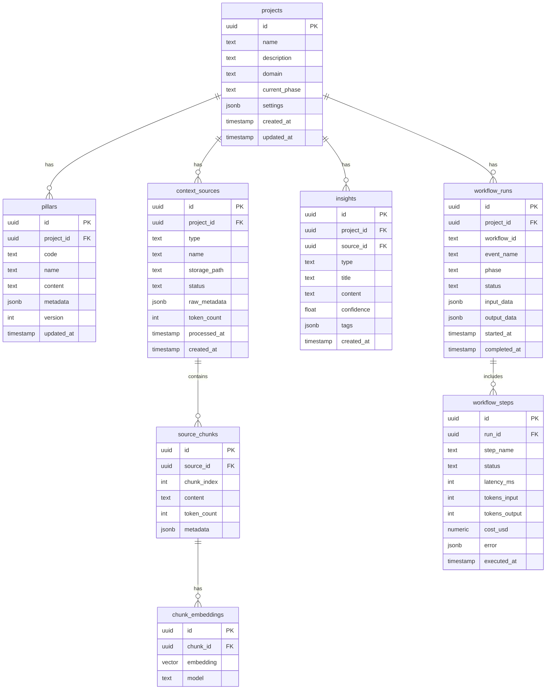

# Supabase Schema for Matrice Data

## Overview

This schema supports the full Matrice methodology with:
- **Projects & Pillars**: Core P1-P6 structure
- **Context Sources**: PDFs, APIs, files with RAG support
- **AI Insights**: Generated insights with compounding
- **Workflow Metrics**: Inngest execution tracking

---

## Entity Relationship Diagram



---

## Tables Detail

### 1. Core Tables

#### `projects`
Main project container with Matrice phases tracking.

| Column | Type | Description |
|--------|------|-------------|
| id | uuid | Primary key |
| name | text | Project name |
| description | text | Project description |
| domain | text | Business domain |
| current_phase | text | Current Matrice phase (P1-P6) |
| settings | jsonb | Project-specific settings |
| created_at | timestamptz | Creation timestamp |
| updated_at | timestamptz | Last update |

#### `pillars`
Store P1-P6 Matrice pillar content per project with versioning.

| Column | Type | Description |
|--------|------|-------------|
| id | uuid | Primary key |
| project_id | uuid | FK to projects |
| code | text | P1, P2, P3, P4, P5, P6 |
| name | text | vision, acteurs, donnees, etc. |
| content | text | Markdown content |
| metadata | jsonb | Additional structured data |
| version | int | Version number |
| updated_at | timestamptz | Last update |

### 2. Context Sources & RAG

#### `context_sources`
All source documents for context engineering.

| Column | Type | Description |
|--------|------|-------------|
| id | uuid | Primary key |
| project_id | uuid | FK to projects |
| type | text | pdf, spreadsheet, api, file, etc. |
| name | text | Human-readable name |
| storage_path | text | Supabase Storage path |
| status | text | pending, processing, ready, error |
| raw_metadata | jsonb | Source-specific metadata |
| token_count | int | Total tokens after processing |
| processed_at | timestamptz | When processing completed |
| created_at | timestamptz | Upload timestamp |

#### `source_chunks`
Semantic chunks from sources for RAG.

| Column | Type | Description |
|--------|------|-------------|
| id | uuid | Primary key |
| source_id | uuid | FK to context_sources |
| chunk_index | int | Order within source |
| content | text | Chunk text content |
| token_count | int | Tokens in this chunk |
| metadata | jsonb | Page number, section, etc. |

#### `chunk_embeddings`
Vector embeddings for semantic search.

| Column | Type | Description |
|--------|------|-------------|
| id | uuid | Primary key |
| chunk_id | uuid | FK to source_chunks |
| embedding | vector(1536) | OpenAI ada-002 or similar |
| model | text | Model used for embedding |

### 3. AI Insights

#### `insights`
Compounded knowledge from AI queries.

| Column | Type | Description |
|--------|------|-------------|
| id | uuid | Primary key |
| project_id | uuid | FK to projects |
| source_id | uuid | Optional FK to source |
| type | text | pattern, learning, decision, etc. |
| title | text | Short title |
| content | text | Full insight content |
| confidence | float | AI confidence score (0-1) |
| tags | jsonb | Categorization tags |
| created_at | timestamptz | When generated |

### 4. Workflow Metrics

#### `workflow_runs`
Track Inngest workflow executions.

| Column | Type | Description |
|--------|------|-------------|
| id | uuid | Primary key |
| project_id | uuid | FK to projects |
| workflow_id | text | Inngest function ID |
| event_name | text | Triggering event |
| phase | text | Matrice phase if applicable |
| status | text | running, completed, failed |
| input_data | jsonb | Event payload |
| output_data | jsonb | Result data |
| started_at | timestamptz | Start time |
| completed_at | timestamptz | End time |

#### `workflow_steps`
Individual step metrics within a workflow.

| Column | Type | Description |
|--------|------|-------------|
| id | uuid | Primary key |
| run_id | uuid | FK to workflow_runs |
| step_name | text | Step identifier |
| status | text | success, failed, skipped |
| latency_ms | int | Duration in milliseconds |
| tokens_input | int | Input tokens used |
| tokens_output | int | Output tokens generated |
| cost_usd | numeric(10,6) | Calculated cost |
| error | jsonb | Error details if failed |
| executed_at | timestamptz | Execution timestamp |

---

## Indexes

```sql
-- Performance indexes
CREATE INDEX idx_pillars_project ON pillars(project_id);
CREATE INDEX idx_sources_project ON context_sources(project_id);
CREATE INDEX idx_sources_status ON context_sources(status);
CREATE INDEX idx_chunks_source ON source_chunks(source_id);
CREATE INDEX idx_insights_project ON insights(project_id);
CREATE INDEX idx_workflow_runs_project ON workflow_runs(project_id);
CREATE INDEX idx_workflow_runs_status ON workflow_runs(status);

-- Vector search index (requires pgvector)
CREATE INDEX idx_embeddings_vector ON chunk_embeddings 
  USING ivfflat (embedding vector_cosine_ops) WITH (lists = 100);
```

---

## RLS Policies

Each table will have Row Level Security enabled with policies based on `auth.uid()` linked to a `user_projects` junction table (or project ownership).

```sql
-- Example for projects table
ALTER TABLE projects ENABLE ROW LEVEL SECURITY;

CREATE POLICY "Users can view their projects" ON projects
  FOR SELECT USING (
    id IN (SELECT project_id FROM user_projects WHERE user_id = auth.uid())
  );
```

---

## Migration Files

The implementation will create these migrations in `supabase/migrations/`:

1. `001_core_tables.sql` - projects, pillars
2. `002_context_sources.sql` - sources, chunks  
3. `003_embeddings.sql` - pgvector extension, embeddings table
4. `004_insights.sql` - insights table
5. `005_workflow_metrics.sql` - runs, steps
6. `006_rls_policies.sql` - security policies
7. `007_functions.sql` - helper functions (similarity search, etc.)

---

## TypeScript Types

Will be generated at `src/types/database.types.ts` using Supabase CLI:

```bash
npx supabase gen types typescript --local > src/types/database.types.ts
```

---

## Next Steps

1. Review this schema design
2. Switch to Code mode to implement migrations
3. Run migrations on local Supabase
4. Generate and validate TypeScript types
